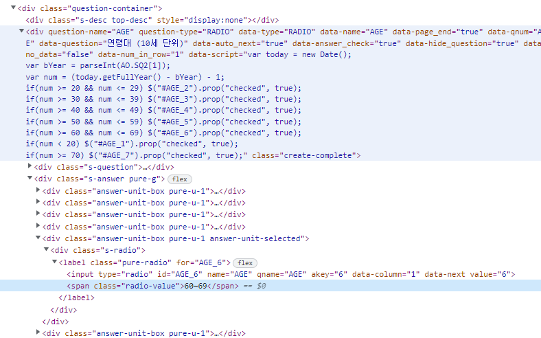

jQuery는 HTML의 요소들을 쉽게 조작하고 편리하게 사용할 수 있도록 만든 JavaScript 라이브러리

다른 사람이 짜놓은 자바스크립트를 가져와서 사용한다고 볼 수 있기 때문에 반드시 사용하기 위해서는 jQuery를 import 하는 구문이 필요합니다.

<br />

## Vanilla-JavaScript와 jQuery 차이점

---

📢 자바스크립트로 접근

```jsx
1. HTML 태그 이름(tag name)을 이용한 선택
→ document.getElementsByTagName(’태그명’);
// ex) document.getElementsByTagName(’div’);

2. 아이디(id)를 이용한 선택
→ document.getElementsById(’아이디명’);
// ex) document.getElementsById(’idSample’);

3. 클래스(class)를 이용한 선택
→ document.getElementsByClassName(’클래스명’);
// ex) document.getElementsByClassName(’classSample’);

4. name 속성(attribute)을 이용한 선택
→ document.getElementsByName(’name속성명’);
// ex) document.getElementsByClassName(’nameSample’);

5. CSS 선택자(selector)를 이용한 선택
→ document.querySelectorAll(’태그 or 태그.클래스, 태그#아이디 or .클래스, #아이디’); 
// ex) document.querySelectorAll(’’); -> div, div.classSample, div#idSample, .classSample, #idSample
```

📢 제이쿼리로 접근

```jsx
1. HTML 태그 이름(tag name)을 이용한 선택
→ $(’태그명’);
// ex $('div');

2. 아이디(id)를 이용한 선택
→ $(’#아이디명’);
// ex $('#idSample');

3. 클래스(class)를 이용한 선택
→ $(’클래스명’);
// ex $('.classSample');

4. name 속성(attribute)을 이용한 선택
→ $(’태그명[name=”이름”]’)
// ex $('div[name="nameSample"]'); $('input[type="checkbox"]');
// name 뿐만 아니라 속성을 접근하여 사용 할 수 있습니다.

5. CSS 선택자(selector)를 이용한 선택
→ 2, 3번 항목
```

<br />

## CSS 제어

---

📢 자바스크립트로 접근

```jsx
// vanilla-javascript
const div = document.getElementById('handleCssById');

div.style.color = 'red';
div.style.fontSize = '1em';
```

📢 제이쿼리로 접근

```jsx
// jQuery
$('#handleCssById').css('color','red');
$('#handleCssById').css('font-size','1em');

// 하나의 선택자로 여러개의 css를 사용할 경우 { }로 묶어서 사용할 수 있습니다.
$('#handleCssById').css(
	{ 'color':'red', 'font-size':'1em' }
);
```


이 밖에 jQuery 함수를 활용해서 자바스크립트로 길게 써야했던 부분들을 간추려서 사용할 수 있습니다.

많은 함수들이 존재하기 때문에 한시간 안에 다 알려드리는건 어려워 메타서베이에서 주로 사용했던 함수들을 소개하려고 합니다.

<br />

## 속성 제어 attr, removeAttr

---

### attr, removeAttr

**attr** 은 요소의 **속성에 대한 값을 가져오거나** **속성에 관련하여 수정**을 할 때 사용하는 함수입니다.

```jsx
// 기본 문법
$('선택한 요소').attr('속성명');
$('선택한 요소').attr('속성명', '값');
```
        
<br />

솔루션을 이용하다 보니까 자동적으로 생성 되는 속성이 있습니다.         

따라서 속성 때문에 원하는 기능으로 동작을 하지 않기도 하고, 문항의 고유 번호가 속성 값으로 정의될 때도 있습니다.        

`attr` 속성에 접근하는 함수 입니다.

attr을 통해서 속성을 수정할 수도 있고, 해당 속성에 관한 값을 가져와 변수에 저장할 수도 있습니다.

간단한 예시를 보면,     

```jsx
$('#SQ8_1_NUMBER_2').attr('readonly','true'); // readonly 속성의 값을 true로 변경
$("#changeImg").attr("src", ""); // src 속성의 값을 '' 으로 변경
```

이벤트가 발생했을 때 속성을 변경하여 더 이상 input에 글자를 입력하지 못하게 할 수도 있고, 불필요한 이미지도 지울 수 있습니다.

`attr`을 사용하여 특정 요소의 값을 가져올 수 있습니다.      

```jsx
$('input').keydown(function() {
    var idx = $(this).attr('vkey');
});
// input 요소가 키 이벤트가 발생했을때 vkey 속성의 값을 idx 변수에 저장
```

`removeAttr` 함수는 속성을 삭제할 때 사용됩니다.

```jsx
// 기본 문법
$('선택한 요소').removeAttr('속성명');
```
        
특정 속성 제거

```jsx
$('div.grade-box[data-current-grade]').removeAttr('data-current-grade');
```

### 메타서베이 예제

---

     

속성을 수정해서 최소, 최대 입력 조건 없애기       

        


        
요청 사항에 따라 메타 서베이에서 임의로 만든 속성을 건드려야하는 경우도 있습니다.

```jsx
$('#SQ8_1_NUMBER_2').attr('readonly','true');
$("#changeImg").attr("src", "");
```

📌 특정 속성인 요소의 값을 가져오기

input 요소가 키 이벤트가 발생했을때 vkey 속성의 값을 idx 변수에 저장한다.

```jsx
$(document).ready(function(){
        .
        .
    if (isCheck === true) {
        $('div.grade-box').empty();
        $('span.grade-body').empty();
        $('div.answer-unit-box').removeClass('answer-unit-selected');
        $('div.s-gradeclick').removeClass('selected');
        $('div.grade-box[data-current-grade]').removeAttr('data-current-grade');

        grade.removeData('data-min_grade');
        grade.removeData('data-max_grade');
        grade.removeData('max-grade');
        grade.removeData('min-grade');
        grade.attr('data-min_grade','0');
        grade.attr('data-max_grade','0');
        grade.attr('max-grade','0');
        grade.attr('min-grade','0');

        var yb1 = `<div class="answer-unit-box pointer pure-u-1 u-md-1-2 answer-unit-selected"><div class="s-gradeclick selected" qname="C_3" akey="23" data-single="false" data-last data-max><div class="grade-box" data-current-grade="1"></div><span class="value text-hover">유튜브</span></div></div>`
        $('div[akey="23"]').parent().replaceWith(yb1);
    } else {
        $('td').eq(2)
        var yb2 = `<div class="answer-unit-box pointer pure-u-1 u-md-1-2"><div class="s-gradeclick" qname="C_3" akey="23" data-single="false" data-last data-max><div class="grade-box" ></div><span class="value text-hover">유튜브</span></div></div>`
        $('div[akey="23"]').parent().replaceWith(yb2);
        grade.removeData('data-min_grade');
        grade.removeData('data-max_grade');
        grade.removeData('max-grade');
        grade.removeData('min-grade');
        grade.attr('data-min_grade','3');
        grade.attr('data-max_grade','3');
        grade.attr('max-grade','3');
        grade.attr('min-grade','3');

        $('div.grade-box').empty();
        $('span.grade-body').empty();
        $('div.answer-unit-box').removeClass('answer-unit-selected');
        $('div.s-gradeclick').removeClass('selected');
        $('div.grade-box[data-current-grade]').removeAttr('data-current-grade');
    }
    })
});
```

**최소, 최대 3개를 선택 해야 하는 순위형**에서 **이전 응답 값**에 따라 **최소 조건을 없애야 해** `attr` 함수를 사용하여 해당 속성 값을 변경하는 예제입니다.     

💡 `removeData` **data 속성으로 설정한 값을 제거**, `empty`선택한 요소의 **내용을 삭제**


## HTML 붙이기

---

### prepend, after, append, before

`before`  **선택한 요소의 앞**에 내용 삽입

`after` **선택한 요소의 뒤**에 내용 삽입

`prepend` **선택한 요소의 자식 요소 앞**에 내용 삽입

`append` **선택한 요소의 자식 요소 뒤**에 내용 삽입

### 메타 서베이 예제

---

`prepend`

임의 input 태그를 만들어서 원하는 위치에 붙여넣기

```jsx
$(document).ready(function(){
       .
			 .
        var input = '<input type="checkbox" class="youtubeCheck" />';
        $('label.pure-checkbox').prepend(input);
        var grade = $("div.create-complete");
        .
				.
    });
```

`after`

💡**요청사항** : 입력한 년도에 따라 자동으로 나이가 계산된 드랍다운 만들기

```jsx
$(document).ready(function(){
    $('#SQ8_1_NUMBER_1').css('display','none');
    $('#SQ8_1_NUMBER_2').attr('readonly','true');

    //SQ4의 선택한 나이 배열
    var ageArr = [];
    var minAge = 1967;
    for (var i = 1; i <= 40; i++) {
        ageArr.push(minAge);
        minAge++;
    }
    //내 나이 찾기
    var ageIndex = AO['SQ4'][1]-1;
    var myAge = ageArr[ageIndex];

    var selectedBox1 = '<select id="SQ8_SELECT_1">';
    selectedBox1 += '<option value="" selected>- 선택 -</option>';

    for (var i = myAge + 19; i <= 2022; i++) {
        selectedBox1 +=
            '<option value="'+i+'">'+i+'</option>'
    }
    selectedBox1 +=
        '</select>'

    //SQ8 드랍다운
    $('#SQ8_1_NUMBER_1').after(selectedBox1);
});
```

**테이블 만들기** ( `append`, `appendTo` 차이 **)**

💡**요청사항** : 설문이 너무 길어 스크롤을 내리다 보면 보기가 보이지 않아 제일 아래쪽에다가 동일한 보기를 만드는 것.

```jsx
$(document).ready(function(){
    $('.s-answer').find('thead').css({"position": "sticky","top": "0px"});

    $('thead tr').remove();

    var tr1 = $('<tr></tr>').appendTo('thead');
    $('<th colspan="1" width="10%"></th>').appendTo(tr1).html('');
    $('<th colspan="2" width="10%"></th>').appendTo(tr1).html('전혀<br>동의하지<br>않는다');
    $('<th colspan="2" width="10%"></th>').appendTo(tr1).html('동의하지<br>않는다');
    $('<th colspan="2" width="10%"></th>').appendTo(tr1).html('보통이다');
    $('<th colspan="2" width="10%"></th>').appendTo(tr1).html('동의한다');
    $('<th colspan="2" width="10%"></th>').appendTo(tr1).html('매우<br>동의한다');

    var tr2 = $('<tr></tr>').appendTo('thead');
    $('<th></th>').appendTo(tr2).html('');
    $('<th></th>').appendTo(tr2).html('1');
    $('<th></th>').appendTo(tr2).html('2');
    $('<th></th>').appendTo(tr2).html('3');
    $('<th></th>').appendTo(tr2).html('4');
    $('<th></th>').appendTo(tr2).html('5');
    $('<th></th>').appendTo(tr2).html('6');
    $('<th></th>').appendTo(tr2).html('7');
    $('<th></th>').appendTo(tr2).html('8');
    $('<th></th>').appendTo(tr2).html('9');
    $('<th></th>').appendTo(tr2).html('10');

    var copyHeader = $(tr1).clone();
    var copyNumber = $(tr2).clone();
    $('table > tbody > tr:nth-child(36)').after(copyHeader).after(copyNumber);
});
```

`append` 의 경우 마지막에 추가

```jsx
// sample1 뒤에 sample2를 추가 합니다.
sample1.append(sample2)

// sample1이 sample2 사이의 마지막에 추가가 됩니다.
sample1.appendTo(sample2)
```

`appendTo`는 요소 사이에 추가 됩니다.

예제를 보면 `th` 요소는 `thead` 요소 사이에 있어야 함으로 `append`가 아닌 `appendTo`를 활용해서 `thead` **요소 안**에 `th` **요소를 추가** 시켜준걸 알 수 있습니다.

### clone, detach

`clone`은 **HTML 요소를 복사하여 새로운 HTML 요소를 생성**

→ **HTML 요소를 복사하여 변수에 담아만 놨을 뿐**이라 보여주기 위해서서는 보여지는 메소드를 이용해야합니다.

`detach`는 잘라내기와 비슷한 기능을 합니다.

`detach` 메소드를 활용해서 변수에 담아 놓으면 언제든지 지웠던 요소를 보여지는 메소드에 이용하여 나타낼 수 있습니다.

둘의 차이는 `clone`의 경우 **복사만 되었기 때문에** **화면에서 복사한 요소가 사라지지 않습니다.**

`detach`의 경우에는 **선택한 요소를 지우고 저장**합니다.

### 메타서베이 예제

📌 테이블 row 추가

```jsx
var tbody = $('table > tbody');

function addRows() {
  for (var i = 0; i < temp.length; i++) {
      var tr = $('tr[vkey='+temp[i]+']').detach();
      tbody.append(tr);
  }
}
```

## 요소에 접근하기

---

### find, eq

**`find`** 선택한 요소의 **하위 요소 중 특정 요소를 찾을 때** 사용

```jsx
// question-name이 Q3인 요소를 찾고 class가 s-answer div 안에서 table tbody 의 요소를 찾는다. 
var tbody = $('div[question-name="Q3"]').find("div.s-answer table tbody")

var $onNode = $("div[question-name='"+qid+"']");	
var $inputNodeClone = $onNode.find("div.s-answer").clone();
```

**`eq(index)`**선택한 요소를 index 번호로 찾을 수 있습니다. ( 0 번 부터 시작 )

```jsx
// vkey가 idx (값) 인 input 요소의 첫 번째 요소의 값을 가져온다.
var hKey1 = +$('input[vkey='+idx+']').eq(0).val();

// vkey가 idx (값) 인 input 요소의 열 번째 요소의 값을 가져온다.
var hKey2 = +$('input[vkey='+idx+']').eq(9).val();
```

### 메타서베이 예제

---

```jsx
function inputEventAdd(){
  $('input').on('keydown',function() {
      var $thisInput = $(this)
				  .
				  .
          var isShow = showArray.indexOf(idx) !== -1;
          var hKey1 = +$('input[vkey='+idx+']').eq(0).val();
          var hKey2 = +$('input[vkey='+idx+']').eq(1).val();
		          .
                  .
  });
}
```

💡 jQuery 에서 값을 가져올 때는 val() 함수를 사용

```jsx
// 1
for(var j = 0; j < tr; j++){
    $('table > tbody > tr').eq(j).find('input[qname=SQ19]:gt('+(+cnt-1)+')').hide();
}

// 2
arrList.forEach(function(ele){
   $('.s-answer').find('tr').eq(ele).show();
})
```

```text
💡 제이쿼리 필터 셀렉터 (:)

:first 첫번째로 일치하는 요소를 가져옵니다.
:last 마지막으로 일치하는 요소를 가져옵니다.
:even 짝수번째 요소를 모두 가져옵니다. 
:odd 홀수번째 요소를 모두 가져옵니다.

:eq(index) index에 해당하는 요소를 가져옵니다.
:gt(index) index 보다 큰 요소를 찾아 모두 가져옵니다.
:lt(index) index 보다 작은 요소를 찾아 보무 가져옵니다.

:has(selector) selector 요소를 하나 이상 포함하고 있는 요소를 가져옵니다.
:not(selector) selector 요소와 일치하지 않는 모든 요소를 가져옵니다.
```
 

## 상위 또는 하위 노드에 접근하기

---

### parent, children

`parent` 는 특정 요소의 부모 요소 (상위)를 선택합니다.

```jsx
// 기본 문법
.parents('선택자');

// 만약 선택자를 명시하지 않으면 특정 요소의 부모 요소의 값을 가져오고
$( 'p' ).parent().css( 'color', 'green' );

// 선택자가 있다면 반드시 부모 요소안에 명시해준 선택자가 존재해야합니다.
// p 요소의 부모 요소가 div 일 때 css 적용
$( 'p' ).parent( 'div' ).css( 'color', 'green' );
```

```text
💡 parent(), parents(), closet()

parent() : 바로 위 부모 요소 하나만 가져옵니다.
parents() : 바로 위 부모 요소를 기준으로 전부 상위 요소를 전부 가져옵니다. 
closet() : 바로 위 부모 요소 하나만 가져옵니다.
```
`parent` 와 `closet`은 하나의 부모 요소를 가져오는 것은 동일합니다.      

두 함수의 차이점은 요소를 찾을 때 탐색하는 범위에 있습니다. 

`parent()` 의 경우 해당 요소의 바로 위에 존재하는 상위 요소 하나만을 반환하며, 

`closet()` 은 특정 요소를 찾을때 까지 돌다가, 존재하면 가장 가까운 요소를 반환하고, 없다면 `Null`을 반환합니다.

### 메타서베이 예제

```jsx
// 상위 요소의 클래스를 지운다.
$('div[akey="23"]').parent().removeClass('answer-unit-selected');
// 상위 요소의 더 상위 요소를 가져온다.
$('label[for=SQ20_'+value+']').parent().parent().show();
// 상위 요소 뒤에 $nextTr 값을 붙인다.
$('tr[vkey='+voteArray[voteIdx]+']').parent().append($nextTr)
```

`children` 는 특정 요소의 자식 요소 (하위)를 선택합니다.

```jsx
// 기본 문법
.children('선택자');

$( 'div' ).children().css( 'color', 'blue' );
$( 'div' ).children( 'p.bl' ).css( 'color', 'blue' );
```

기본 문법은 `parent` 함수와 동일 합니다.

선택자를 명시하지 않을 경우에는 특정 요소의 하위 요소의 값을 가져오고 선택자를 명시했을 경우에는 반드시 그 선택자가 존재해야 합니다.

### 메타서베이 예제

📌 body 요소 안에 있는 요소들을 삭제

```jsx
var tbody = $('div[question-name="Q3"]').find("div.s-answer table tbody")
tbody.children().remove();
```

## **Event 제어**

---

### **이벤트 처리 방식 - 객체에 직접 이벤트 등록 (event binding)**

```jsx
// 직접 이벤트 부여
$('input[type="button"]').click(function () { });

// on
// 이벤트를 바인딩
$('input[type="button"]').on('click', function() { /* 내부에 이벤트가 발생했을 때 사용할 함수 정의*/ });
$('input[type="radio"]').on('change', function() { });
$('input[type="button"]').on('submit', function() { });
$('input[type="text"]').on('keydown', function() { });

// on을 통하여 여러 이벤트 바인딩을 할 수 있다.
$('input[type="text"]').on({ 
	'click': function() { }, 'keydown': function() { }, 'blur': function() { }, 
 })

// off
// 더 이상 사용하지 않는 이벤트와 바인딩을 제거
$('input[type="button"]').off('click', function() {} );

// bind
$('input[type="button"]').bind('click', function() {} );

// one
// 1 번만 실행됨
$('input[type="button"]').one('click', function() {} );
```

### Event 종류
___


**마우스 이벤트**

| 이벤트 | 설명 |
| --- | --- |
| click | 마우스 포인터로 눌렀다가 떼었을 때에 발생 |
| dblclick | 더블 클릭 했을 때에 발생 |
| hover | mouseenter와 mouseleave 이벤트를 한번에 bind한다 |
| mousedown | 마우스를 눌렀다가 떼었을 때에 발생 |
| mouseenter | 마우스가 진입했을 때에 발생(자식노드에서는 이벤트를 감지 못함) |
| mouseleave | 마우스가 노드에서 벗어났을 때에 발생 |
| mousemove | 노드 영역에서 마우스를 움직였을 때에 발생 |
| mouseout | 노드에서 마우스 포인터가 떠났을 때에 발생 |
| mouseover | 노드 영역에서 마우스를 올려놓았을 때 발생 (내부노드까지 이벤트를 감지) |
| mouseup | 마우스 포인터를 노드에 올려놓고 마우스 버튼을 눌렀다 떼었을 때에 발생 |
| toggle | click 이벤트에 핸들러를 바인딩하고 클릭할 때마다 실행될 함수들을 차례대로 실행 |

<br />

**폼 이벤트**

| 이벤트 | 설명 |
| --- | --- |
| blur | 포커스가 떠날 때에 발생 |
| change | 값이 변경될 때에 발생 |
| focus | 포커스를 획득했을 때에 발생 |
| select | 텍스트를 선택했을 때에 발생 |
| submit | 폼의 내용을 전송할 때에 발생 |

<br />

**키보드 이벤트**

| 이벤트 | 설명 |
| --- | --- |
| keydown | 해당 영역에서 키보드를 눌렀을 때에 발생 |
| keypress | 해당 영역에서 키보드를 계속 누르고 있을 때 발생 |
| keyup | 해당 영역에서 키보드를 눌렀다가 떼었을 때 발생 |

<br />

### 메타서베이 예제

📌 SQ17 문항에서 없음을 선택하지 않았을 경우 조건 확인하고 넘어가도록

```jsx
$(document).ready(function(){
    var isCheck = +AO['SQ17'].NUMBER_1;
    var isNone = +AO['SQ17'].NOA_99;
   
    if(!isNone){
        $('button#next').unbind("click").on("click", function () {
            var size = $('.answer-unit-selected').length;
            var result = false;
            var message = '선택하신 개수에 맞게 응답해주세요. ( 가지고 있는 명품 개수 : '+isCheck+' )';

            //선택한 값이 없을 경우
            if(isCheck && size && isCheck >= size){  //선택한 값이 존재할 경우
                result = true;
            }

            if(result){
                $('.main-warning').html('');
                $('.main-warning').css('display','none');
                $('button#next').unbind("click").on("click", Save.next);
                Save.next()
            } else {
                $('.main-warning').html(message);
                $('.main-warning').css('display','block');
            }
        });
    }
});
```

📌 qname이 SQ19 인 input이 바뀔 때마다 disableInput 함수를 실행

```jsx
$('input[qname=SQ19]').on('change',disableInput);
```

<br />

💡**이벤트가 발생할 때마다 함수를 찾아 실행하는 것**이기 때문에 function() { } 이 아닌 함수를 따로 만들어서 가져다가 쓸 수 있습니다.

<br />

