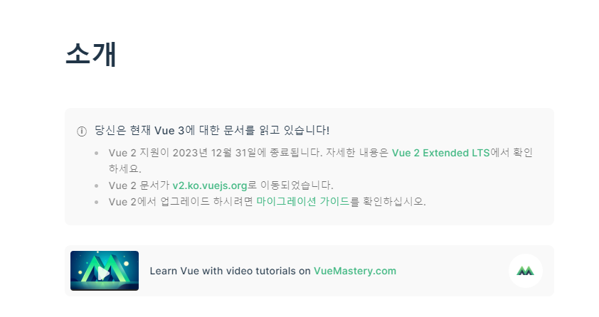

### 목차
- [Options Api 방식](#1-options-api-방식)     
- [Composition Api 방식](#2-composition-api-방식-with-setup)
- [v-model 선언 방식](#v-model-선언-방식-차이)
  - [Vue2](#vue2-에서의-방법)
  - [Vue3](#vue3-에서의-방법)
- [Computed 선언 방식](#computed-선언-방식-차이)
  - [Vue2](#vue2-ec9790ec849cec9d98-ebb0a9ebb295-1)
  - [Vue3](#vue3-ec9790ec849cec9d98-ebb0a9ebb295-1)
- [Watch / Prop 선언 방식](#watch--props-선언-방식-차이)
  - [Vue2](#vue2-ec9790ec849cec9d98-ebb0a9ebb295-2)
  - [Vue3](#vue3-ec9790ec849cec9d98-ebb0a9ebb295-2)
- [Emit 선언 방식](#emit-선언-방식-차이)
  - [Vue2](#vue2-ec9790ec849cec9d98-ebb0a9ebb295-3)
  - [Vue3](#vue3-ec9790ec849cec9d98-ebb0a9ebb295-3)
- [Route / Router 선언 방식](#router--route-선언-방식-차이)
  - [Vue2](#vue2-ec9790ec849cec9d98-ebb0a9ebb295-4)
  - [Vue3](#vue3-ec9790ec849cec9d98-ebb0a9ebb295-4)
- [Store 선언 방식](#store-선언-방식-차이)
  - [Vue2](#vue2-ec9790ec849cec9d98-ebb0a9ebb295-5)
  - [Vue3](#vue3-ec9790ec849cec9d98-ebb0a9ebb295-5)

---

<br />

최근에 Vue 2 버전이 2.7 버전을 끝으로 업데이트가 종료된다는 소식을 듣게 되어 Vue 3 버전과 어떤 차이점이 있는지 제가 알고 있는 선에서 공유 드리고자 이 주제로 글을 작성하였습니다.

<br />

<center>
    
</center>

<br />
버전이 올라가면서 라이프사이클에도 약간의 변화가 생기긴 했지만 이번 포스팅에서는 사용하는 문법 위주로 소개해보려고 합니다.


<br />

**Vue 2** 에서의 스크립트 작성 방식은 **Options API** 방식과 **Class Component** 방식 2 가지가 있습니다.

<center>
    (저희는 Class Component 형태로 주로 사용하고 있죠)
</center>

<br />

Options API 가 **OOP 를 배경**을 두고 만들어졌기 때문에 **Class 기반**으로 잘 맞는다고 합니다.


### 1. Options API 방식

Options API 방식은 `data`, `methods`, `mounted` 와 같은 객체를 사용하여 컴포넌트의 로직을 정의하는 방법을 뜻합니다.

```typescript
// Options API
export default Vue.extend({
	name: "SampleComponent",
	data: () => { return { sample: ''} },
	methods: {},
	mounted: {}.
}

// Class 형 Component
export default class SampleComponent extends Vue {
	sample = '';
})
```

Vue 객체를 extends 받아서 새로운 Component 객체를 생성하는 방식

### 2. Composition API 방식 with setup()

Vue 3로 버전이 올라가면서 새롭게 추가된 방식으로 Composition API 방식과 setup() 가 추가되었습니다.

setup 함수를 이용하는 방법은 2 가지가 있습니다.

기존 Vue2에서 사용했던 문법에 setup() 함수만 추가해주면 됩니다.         
다만 이렇게 사용할 경우 반드시 사용된 **변수 또는 함수에 대해서 return 으로 내보내줘야 template 에서 사용할 수 있습니다.**

```typescript
export default defineComponent({
	copmonents: {},
	setup() {
        // 변수 선언
		const sample = ref('sample');

        // 함수 선언
        const onClickHandler = () => {
            console.log(`click`);
        }

		return {
			sample, onClickHandler
		}
	}
})
```

<br />

이 방법을 보완하고자 나온게 **script setup 문법**입니다.

<br />

```typescript
<script lang='ts' setup>
// 필요한 컴포넌트는 단순 import 만 해주면 사용할 수 있다.

const sample = ref('')

</script>
```

srcript 안에 setup 만 넣어주면 return 문 없이 바로 template 에서 사용할 수 있습니다.

setup 함수 내에서 React처럼 `render 함수`와 `JSX`를 지원하고있어 `template` 없이 컴포넌트를 구성할 수 있다고 하는데 이 방법은 아직 안해봤습니다..ㅎㅎ

컴포지션 API가 추가 로직 재사용 및 코드 구성 이점과 함께 뛰어난 TypeScript 통합을 제공한다는 점을 감안할 때 **Vue 3에서 Class API를 더 이상 사용하지 않는 것이 좋다**. 라고 합니다.

<center>
(CompositionAPI 방식은 Vue2.7 버전에서는 사용 가능)
</center>

<br />

## v-model 선언 방식 차이

---

### Vue2 에서의 방법

<br />

Vue 2에서 Data 변수를 선언할 때 data 함수 내부에 선언해주거나 Class 내부에 선언만 해주면 변수 선언이 끝이나게 됩니다.

```typescript
export default {
    data() {
        return {
            isLoading = true;
            recipeId = '';
            recipeLists = [];
        }
    }
}

export default class SampleComponent extends Vue {
    isLoading = true;
    recipeId = '';
    recipeLists: Recipe.info[] = [];
}

```

### Vue3 에서의 방법

<br />

#### 1. Ref 를 사용한 방법

Vue3 이전에는 뷰 템플릿의 **DOM** 또는 **컴포넌트**를 가리키는 **속성**이었지만, Vue3에서는 `reactive reference`를 의미합니다.

<br />

```typescript
<script setup lang='ts'>
import { ref, Ref } from "vue";

const isLoading: Ref<boolean> = ref(true);
const recipeId: Ref<string> = ref('');
const recipeLists: Ref<Recipe.Info[]> | Recipe.Info[] = ref([]);
</script>
```

<br />

**원시형 데이터**는 `ref`로 이용하여 반응형 데이터를 관리 (Object 와 같은 타입도 선언 가능합니다. <타입의 영향을 받지 않음>)

데이터 접근 방식 : `isLoading.value`, `recipeId.value` 와 같이 .value를 통하여 접근할 수 있습니다.

value 값을 변경하거나 가져올 때도 동일하게 .value로 접근하면 됩니다.

<br />

```text
💡 원시형 데이터

boolean, number, string, undefined, null, symbol
```

<br />

#### 2. Reactive를 사용한 방법

<br />

```typescript
<script setup lang='ts'>
import { reactive } from "vue";

interface STATE {
    isLoading: boolean;
    recipeId: string;
    recipeLists: Recipe.info[];
}

const state: STATE = reactive({
    isLoading: true,
    recipeId: '',
    recipeLists: [],
});
// state 객체에서 꺼내서 사용 가능
const { isLoading, recipeId, recipeLists } = state;
</script>
```

참조형 데이터는 `Reactive` 를 사용

Vue2에서 사용하는 data() 내에 선언하는 방식과 비슷합니다.

<br />

```text
💡 참조형 데이터

Array, Object, Map, Set 등
```

<br />

## Computed 선언 방식 차이

---

### Vue2 에서의 방법

<br />

```typescript
export default {
    computed: {
        isLogin: function() {
            return this.$store.getters["utilModule/isLogin"];
        }
    }
}

get isLogin() {
    return this.$store.getters["utilModule/isLogin"];
}
```

### Vue3 에서의 방법

<br />

```typescript
import { computed, ComputedRef } from "vue";
import stroe from "@coponents/store";

const isLogin: ComputedRef<boolean> = computed(() => store.getters["utilModule/isLogin"]);
```

vue 에서 `computed` 를 import 받아 사용합니다.      
또한 ComputedRef Type을 지원하고 있어 타입을 지정해 줄 수 있습니다.


<br />

## Watch / Props 선언 방식 차이

---

### Vue2 에서의 방법

<br />

```typescript
import { Prop, Watch } from 'vue-property-decorator';

@Prop({ default: false }) readonly isOpen: boolean;

@Watch('isOpen')
watchProps() {
    // logic 작성
}
```

<br />

### Vue3 에서의 방법

<br />

```typescript
import { defineProps, withDefaults, defineEmits, watch } from "vue";

const props1 = defineProps({
    isOpen: {
        type: boolean,
        required: true,
    }
}) // default 값 없음
const propsDefault = withDefaults(defineProps<{ isOpen: boolean }>(), { isOpen: false })

watch(route, () => keyword.value = '', { deep: true, immediate: false })
```

vue에서 필요한 함수를 import 하여 사용합니다.

`defineProps` 함수를 사용하여 Props를 선언하고,      
`withDefaults` 함수를 사용하여 Prop의 기본값을 설정할 수 있습니다.

```text
💡 **deep이나 immediate이란?**    

deep: 지정한 속성안에 있으면, 그 속성 또한 감시 대상으로 지
immediate: 페이지를 읽어들일 때에도 watch를 실행
```

기본적으로 watch는 지정한 속성만 감시하는데 deep true를 줬을 경우 지정한 값의 내부안의 값 또한 감시 대상으로 올립니다.      

페이지가 실행되는 시점에는 watch가 동작하지 않습니다.

<br />

## Emit 선언 방식 차이

---

### Vue2 에서의 방법

<br />

```typescript
import { Emit } from 'vue-property-decorator';

// 1. Decorator 사용
@Emit('closeMenu')
closeMenu() {
  .
  return !isOpen;
}

// 2. Vue 객체 이용 
closeMenu() {
	.
	return this.$emit('uploadResult', !isOpen);
}
```

### Vue3 에서의 방법

<br />

```typescript
import { defineEmits } from "vue";

// emit Event 정의
const emit = defineEmits(['closeMenu']);

// 정의한 이벤트 호출
const sendDataToParentComponent = (isOpen: boolean) => {
	emit('closeMenu', !isOpen);
};
```

<br />

## Router / Route 선언 방식 차이

---

### Vue2 에서의 방법

<br />

```typescript
this.$router.push('/');

const { title } = this.$route.query as { title: string };
```

<br />

### Vue3 에서의 방법

<br />

```typescript
import { useRouter, useRoute } from "vue-router";

const router = useRouter();
const route = useRoute();

const redirect = (): void => {
	router.push('/');
}

const { title } = route.query as { title: string };
```

`useRouter()` `useRoute()` 훅을 호출하여 라우터 기능을 사용할 수 있습니다.

<br />

## Store 선언 방식 차이

---

### Vue2 에서의 방법

<br />

```typescript
this.$store.dispatch('socketStore/readMessageAll', this.userId)
```

### Vue3 에서의 방법

<br />

```typescript
import store from '@/store';

store.commit("utilModule/setCurrentPath", 0);
```

#### Strore import 시 주의할점

<br />

```typescript
import { useStore } from "vuex";

const store = useStore();

store.commit("utilModule/setCurrentPath", 0);
```

**setup 함수 내에 useStore() 함수를 호출할 경우** 콘솔에서 아래와 같은 경고 문구를 볼 수 있습니다.

```bash
❗ vue warn inject() can only be used inside setup() or functional components
```

useStore() 훅을 통해 store 객체를 바로 호출하기 보다는 **createStore() 이용하여 만들어진 store를 호출**하는 방식으로 변경하면 경고 문구는 사라지게 됩니다.

```typescript
// src > stroe > index.ts

import { createStore } from "vuex";
import createPersistedState from "vuex-persistedstate";

export default createStore({
  plugins: [
    createPersistedState({
      paths: [],
    }),
  ],
  modules: {},
});
```


